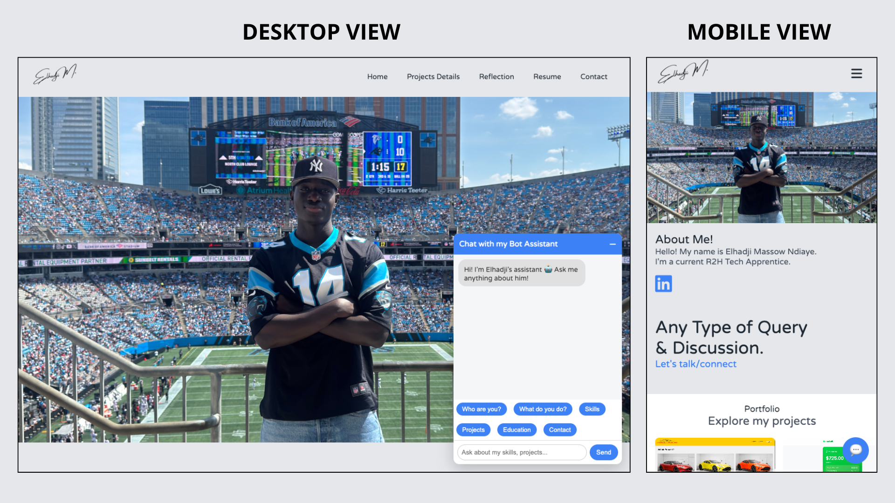

# Personal Portfolio Website

Welcome to my personal portfolio website a modern, responsive, and scalable platform designed to showcase my **skills, certifications, and projects**.  
This project demonstrates real-world frontend best practices, including **advanced CSS techniques**, **JSON-driven data management**, and the **integration of an interactive chatbot** that answers questions about me and my work.

The website is built with a strong focus on **maintainability, flexibility, and user experience**.

- 👉 Live website: https://main.d2b2cr7wdqzy67.amplifyapp.com/

---

## Features

- **Professional Portfolio Layout**

  - Clean and modern UI focused on usability and clarity
  - Dedicated sections for skills, certifications, and projects

- **Advanced CSS Implementation**

  - Advanced CSS techniques applied to the **Project Details pages**
  - Smooth transitions, layouts, and visual hierarchy

- **Project Details Powered by JSON**

  - Project data loaded dynamically from **JSON files**
  - No hard-coded project content in HTML
  - Ensures **scalability and flexibility** for future updates

- **Chatbot Integration**

  - Interactive chatbot that answers questions about me, my skills, and my experience
  - Enhances user engagement and accessibility of information

- **Fully Responsive Design**

  - Optimized for **mobile, tablet, and desktop devices**
  - Consistent experience across screen sizes

- **Project Showcases**
  - Embedded **videos** to demonstrate project functionality
  - **Live demo links** for real-time project previews

---

## Technologies Used

- HTML5
- CSS3 (Advanced styling and layouts)
- SASS
- JavaScript (Dynamic content, chatbot logic, DOM manipulation)
- JSON (Data-driven project architecture)

---

## Installation & Usage

1. git clone
2. open index.html / go live
3. Browse projects, view details, watch demo videos etc...

- -> Use it without installing: https://main.d2b2cr7wdqzy67.amplifyapp.com/
